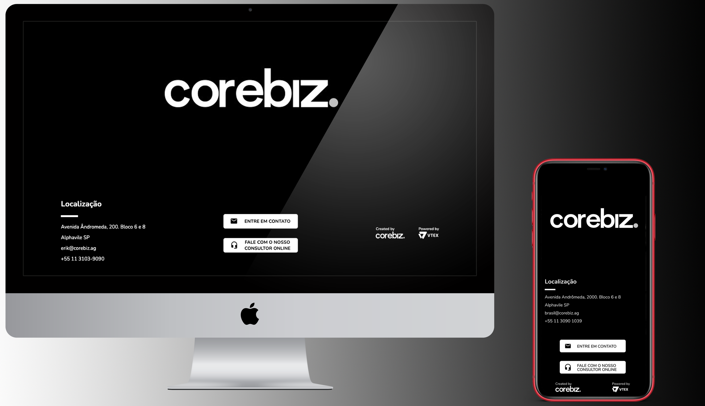

<h1 align="center">
    
</h1>

  <a href="#-tecnologias">Tecnologias</a>&nbsp;&nbsp;&nbsp;|&nbsp;&nbsp;&nbsp;
  <a href="#-projeto">Projeto</a>&nbsp;&nbsp;&nbsp;|&nbsp;&nbsp;&nbsp;
  <a href="#-layout">Layout</a>&nbsp;&nbsp;&nbsp;|&nbsp;&nbsp;&nbsp;

 

##  Tecnologias

Esse projeto foi desenvolvido utilizando as seguintes tecnologias:

- [HTML5](https://www.w3schools.com/html/)
- [CSS3](https://www.w3schools.com/css/)
- [Java Script](https://www.javascript.com)
- [React](https://reactjs.org)

##  Projeto
Replicando um projeto HTML/CSS (footer) em JavaScript e React.
 
- Executar o **yarn start** no terminal;
  * Abrir http://localhost:3000 para visualizar no browser;
  * A página irá recarregar de acordo com as edições;
  * É possivél ver qualquer erro de lint no console;
  
  
- Projeto responsavél pela <a href="https://www.corebiz.ag/en/" target="_blank">Corebiz</a> desenvolvido no dia 15/01/2021 durante a edição do <a href="https://conteudo.corebiz.ag/gobeyond" target="_blank">GoBeyond</a>. Aula ministrada pelo **[@Leonardo Oliveira](https://github.com/leonardoXoliveira)**.

 
##  Layout

  

---

Desenvolvido por Erik Ieto

